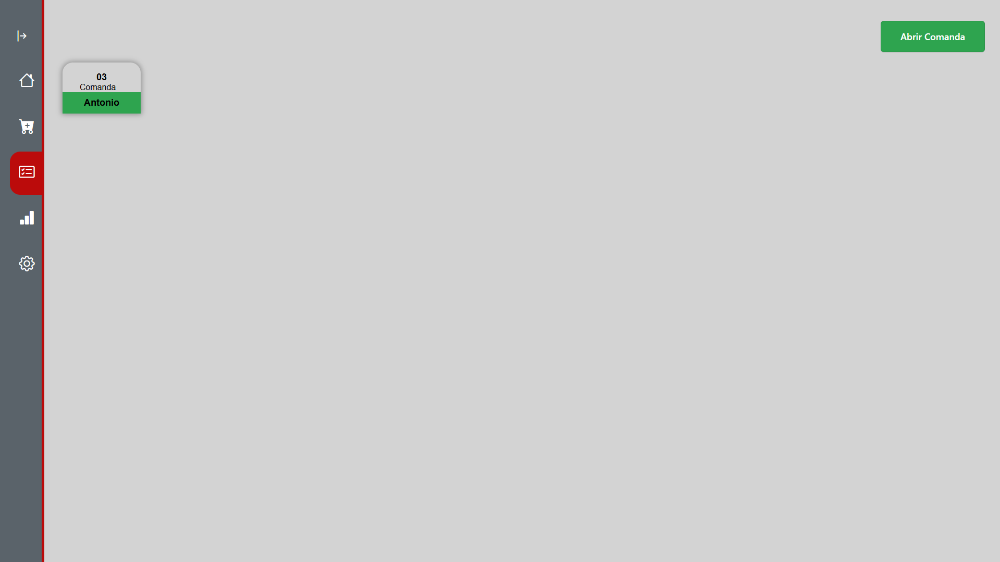

## 6. Interface do sistema

## 6.1. Tela principal do sistema

Barra de navegação do sistema.

## 6.2. Telas do processo 1

Tela para o cadastro dos produtos e lançamento de perda. 

Tela para o cadastro dos pratos. 

## 6.3. Telas do processo 2

Tela para abrir comandas novas e selecionar comanda. 

Tela para abrir comandas novas e selecionar comanda. 

## 6.3. Telas do processo 3

Tela para realizar o pagamento da comanda. 

## 6.3. Telas do processo 4

Tela com grafico de tempo medio de atendimento. 

Tela com grafico de lucratividade. 

Tela com os dados sobre o desperdicio de produtos. 

