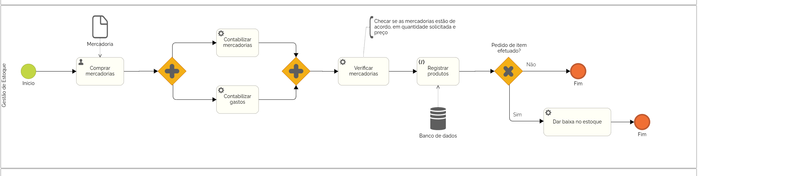

### 3.3.2 Processo 1 – GESTÃO DE ESTOQUE

O projeto de Gestão de Estoque, representado através do BPMN, visa otimizar e automatizar o gerenciamento de mercadorias em um sistema. O processo é dividido em duas etapas principais: Cadastrar Mercadorias e Alterar estoque.

**Cadastrar Mercadorias/Adicionar no banco de dados**

| **Campo**       | **Tipo**         | **Restrições** | **Valor default** |
| ---             | ---              | ---            | ---               |
| [Nome do campo] | [tipo de dados]  |                |                   |
| Nome da mercadoria           |Texto   | Obrigatorio |                |
| Quantidade           | Número   | Maior que 0 |           |
| Preço           | Número   | Maior que 0 |           |
|Categoria         |Select | Obrigatorio|           |

| **Comandos**         |  **Destino**                   | **Tipo** |
| ---                  | ---                            | ---               |
| Confirmar registro               | Registrar prodtudo no banco de dados              | 0           |

**Alterar estoque**

| **Campo**       | **Tipo**         | **Restrições** | **Valor default** |
| ---             | ---              | ---            | ---               |
| [Nome do campo] | [tipo de dados]  |                |                   |
| Mercadoria             | Número                 | Maior que 0             |                   |

| **Comandos**         |  **Destino**                   | **Tipo**          |
| ---                  | ---                            | ---               |
| Lançar estoque                     | Alterar estoque                               | 0                  |
