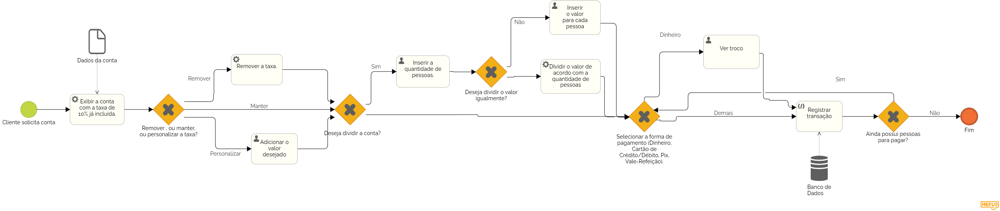

### 3.3.3 Processo 2 – Gestão de Pagamento

O projeto de Gestão de Pagamento, representado atráves do BPMN, possui como objetivo principal aprimorar, potencializar e automatizar a gestão de pagamentos em um sistema de restaurantes. 
O processo é dividido em 3 principais etapas, são elas: 
   - Informar se vai pagar a taxa
   - Inserir a quantidade de pessoas
   - Inserir a quantia de dinheiro e calcular o troco

**Informar se vai pagar a taxa**

| **Campo**       | **Tipo**         | **Restrições** | **Valor default** |
| ---             | ---              | ---            | ---               |
| Select| Seleção unica |      Obrigatorio        |         0          |
|                 |                  |                |                   |

| **Comandos**         |  **Destino**                   | **Tipo**          |
| ---                  | ---                            | ---               |
| Retirar/Inserir a taxa | Registrar entrada de dados | Numérico |
|                      |                                |                   |

**Insere a quantidade de pessoas**

| **Campo**       | **Tipo**         | **Restrições** | **Valor default** |
| ---             | ---              | ---            | ---               |
| Insere a quantidade de pessoas | Números  | Maior que 0 |         1         |
|                 |                  |                |                   |

| **Comandos**         |  **Destino**                   | **Tipo**          |
| ---                  | ---                            | ---               |
| Adicionar a quantidade de pessoas | Registrar entrada de dados  | Numérico |
|                      |                                |                   |

**Insere a quantia de dinheiro e vê o troco**

| **Campo**       | **Tipo**         | **Restrições** | **Valor default** |
| ---             | ---              | ---            | ---               |
| Insira a quantia em dinheiro | Números  | Maior que 0 |         1         |
|                 |                  |                |                   |

| **Comandos**         |  **Destino**                   | **Tipo**          |
| ---                  | ---                            | ---               |
| Adicionar a quantia em dinheiro | Registrar entrada de dados  | Numérico |
| Calcular troco | Registrar saída de dados  | Numérico |
|                      |                                |                   
