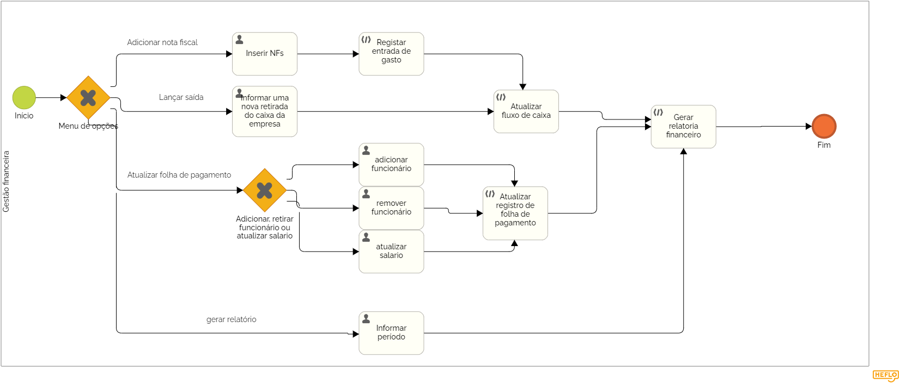

### 3.3.4 Processo 4 – Gestão financeira.
O projeto de Gestão financeira, representado através do BPMN, visa otimizar e automatizar o gerenciamento do fuxo de cicha da empresa.

**Inserir NFs**

| **Campo**       | **Tipo**         | **Restrições** | **Valor default** |
| ---             | ---              | ---            | ---               |
| Inserir Número da NF | Número           | Máximo de 9 caracteres |   0  |
| Valor da NF     | Número           |Valor maior que 0       |     R$0   |
| Descrição       | Campo de texto   |Minimo de 10 caracteres |  Despesa  |

| **Comandos**         |  **Destino**                   | **Tipo** |
| ---                  | ---                            | ---               |
| Registra NF          |  Resgistrar entrada de dados   | booleam|

**Informar nova retirada do caixa da empresa**

| **Campo**       | **Tipo**         | **Restrições** | **Valor default** |
| ---             | ---              | ---            | ---               |
| Motivo da Retirada    | Campo de texto           | Minimo de 10 caracteres |   0       |
| Valor da Retirada     | Número           |Valor maior que 0       |     R$0   |
| Descrição       | Campo de texto   |Minimo de 10 caracteres |  Despesa  |

| **Comandos**         |  **Destino**                   | **Tipo**          |
| ---                  | ---                            | ---               |
| Registra Retirada    |  Resgistrar saida de dados     |  booleam|
|                      |                                |                   |

**Adicionar funcionário**

| **Campo**       | **Tipo**         | **Restrições** | **Valor default** |
| ---             | ---              | ---            | ---               |
| Selecionar cargo | seleção única   | Selecionar uma opção  |        |
|Números de Funcionários    | Número           |Valor maior que 0   |     0   |

| **Comandos**         |  **Destino**                   | **Tipo**          |
| ---                  | ---                            | ---               |
| Registra adição      |  Atualizar folha de pagamento  |  booleam|
|                      |                                |                   |

**Remover funcionário**

| **Campo**       | **Tipo**         | **Restrições** | **Valor default** |
| ---             | ---              | ---            | ---               |
| Selecionar cargo | seleção única   | Selecionar uma opção  |        |
|Números de Funcionários    | Número           |Valor maior que 0   |     0   |

| **Comandos**         |  **Destino**                   | **Tipo**          |
| ---                  | ---                            | ---               |
| Registra subtração   |  Atualizar folha de pagamento  |  booleam|
|                      |                                |                   |

**Atualizar Salario**

| **Campo**       | **Tipo**         | **Restrições** | **Valor default** |
| ---             | ---              | ---            | ---               |
| Selecionar cargo | seleção única   | Selecionar uma opção  |        |
|Números de Funcionários    | Número           |Valor maior que 0   |     0   |

| **Comandos**         |  **Destino**                   | **Tipo**          |
| ---                  | ---                            | ---               |
| Registra atualização   |  Atualizar folha de pagamento  |  booleam|
|                      |                                |                   |

**Gerar Relatório**

| **Campo**       | **Tipo**         | **Restrições** | **Valor default** |
| ---             | ---              | ---            | ---               |
| Data  de início|  Data            |  data anterior a data atual |  dia 1 do mês vigente     |
|Data do fim     | data           |data posterior a data de início  |    dia 1 do mês vigente    |

| **Comandos**         |  **Destino**                   | **Tipo**          |
| ---                  | ---                            | ---               |
| Gerar Relatorio   |  Gerar Relatorio      | booleam|
|                      |                                |                   |

